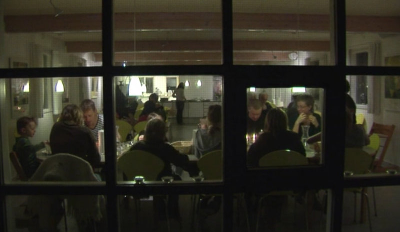
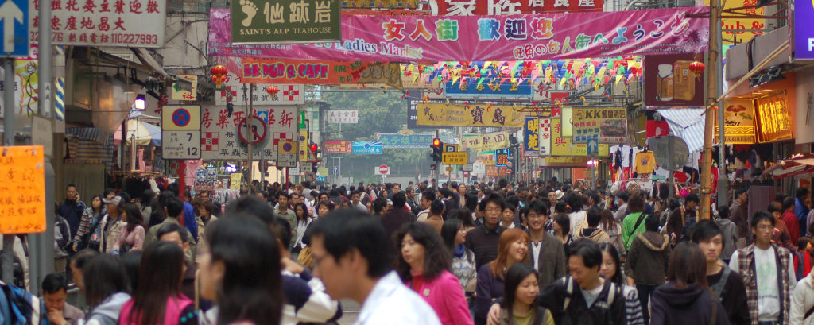

Roko Belic’s 2011 documentary film <cite>Happy</cite> ([Hoopla](https://www.hoopladigital.com/title/11165554)) had many memorable situations but the one I keep returning to is co-housing. Around the 39th minute, the film discusses the system in Denmark, where where several families live on a plot of land or a single building even, where specific duties, amenities, and projects are shared by all co-housers. The film explains the system through a case study of a single mother who describes the Jernstobereit co-house as the “miracle” she was looking for. Twenty families. Large communal areas attached to small condos. The children see their co-house siblings as a big extended family.

A child: “It’s nice to have grown-ups who are always looking out for us. If I’ve hurt myself down in the hall then someone always comes running. It doesn’t absolutely have to be my mom.” Her friend: “We eat together—it’s very very nice.”

Which brings up one of the most fascinating aspects of this co-house: shared meals “nearly every evening” where each family cooks for everyone one or two times *a month*, “maybe four or five hours”—the woman’s happiness with this, instead of having to plan and cook and clean up *every night* is palpable. She finds the idea of two teenagers cooking for forty to fifty people “really cool” and it’d be hard not to agree: in addition to this, the elderly in the community are like grandparents to the children—apparently the co-housing movement was ignited by one Bodil Graae, who in 1967 published, “Every child should have 100 parents” ([Cohousing.org](http://www.cohousing.org/node/1537)). Rather than scrambling after returning from work, one has a couple of hours with one’s children.

Even my single or childless friends would agree that it sounds quite pleasant, even after incorporating all potential downsides that one’s grownup mind raises. Two families in the last two days have told me how they don’t really cook—I can’t blame them. It’s a huge burden on one’s time and energy budget, and doing it takes serious commitment because outsourcing health to corporations is bad for your bank account and for your health. Co-housing serves as a complement to other ways to meet the time/energy/money budget, through a holistic rethinking of how dwellings work and how people live. It could greatly reduce the costs of cooking, and even growing one’s own food.

---

Jane Jacobs raised children in dense inner cities and, in her magnum opus <cite>Death and Life of Great American Cities</cite>, quotes film-maker Charles Guggenheim about St. Louis: “If anybody picked on them, there was always a storekeeper they could run to or somebody to come to their aid.” She points out the obvious: kids “under the eyes of a high numerical ratio of adults” are safer. She describes midtown West Side of Manhattan:

> Hundreds of children, directly under the eyes of innumerable adults using the sidewalks themselves and looking from windows, were engaged in a vast variety of sidewalk games and whooping pursuits.

Later in her walk, she finds:

> Twenty-eight children of all ages were playing on the sidewalk without mayhem, arson, or any event more serious than a squabble over a bag of candy. They were under the casual surveillance of adults primarily visiting in public with each other. The surveillance was only seemingly casual, as was proved when the candy squabble broke out and peace and justice were re-established. The identities of the adults kept changing because different ones kept putting their heads out the windows, and different ones kept coming in and going out on errands, or passing by and lingering a little. But the numbers of adults stayed fairly constant—between eight and eleven—during the hour I watched. Arriving home, I noticed that at our end of our block, in front of the tenement, the tailor’s, our house, the laundry, the pizza place and the fruit man’s, twelve children were playing on the sidewalk in sight of fourteen adults.

---

Some may balk at the tininess of homes required by this co-housing or urban densities. Sharon Lam, who grew up in Hong Kong, talks about her grandmother in trying to explain the infamous Kowloon Walled City (this is from “In the shadow of the Kowloon Walled City” ([Salient](http://salient.org.nz/2015/09/in-the-shadow-of-the-kowloon-walled-city/))):

> … the culture of Hong Kong is focused on life on the street, with almost all social activities and vibrance exhibited in market and food places, stores, and community spaces. Since life in Hong Kong focuses on the shared street areas rather than in the home, pragmatism and functionality within the home are the main concerns for residents—something that public housing satisfies.
>
> This is something that is seen across all socio-economic groups in Hong Kong. Luxurious privately owned flats are just as architecturally standardised and repetitive, and a very small majority of Hong Kong residents live in large standalone houses. These houses aren’t simply reserved for the very wealthy—they are simply not desired. An apartment on a bustling street is the dream. A large house in a quiet, dead neighbourhood? “How can people live like that?” my grandmother would ask.
>
> The notion that my grandmother would not give up her apartment—the size of three parking spaces—for any private, lawned house is sometimes difficult to comprehend. Westerners often describe the small size of flats and high-density living in Hong Kong as “overcrowding”. However, Hong Kong has a past and present of dense populations and scarce land, unseen in most parts of the world, making the definition of “overcrowding” a culturally relative term.

Through this compelling analysis I grow accustomed to the notion that architectural and social space can be so culturally variable, and my hope that this kind of closeness can be transplanted in societies like ours, where the dream is a big house separate from your quiet neighbors. “How can people live like that?” indeed!

---

I think experiments with co-housing can and should be pursued in our country. Successful communities can expect economic and health benefits, that virtuously cycle and build upon each other.

Postscript. The director of *Happy*, Mr Belic, also directed the 1999 film <cite>Genghis Blues</cite> about American blues musician Paul Pena’ visit to the Tyva Republic, hosted by national treasure Kongar-ol Ondar, to compete in a throat singing competition. There’s a cameo by Richard Feynman—no, I’m not joking, *that* Mr Feynman.

(Banner image credit: [US National Park Service](https://www.nps.gov/ciro/learn/historyculture/index.htm). Canal and Baxter: [User:Pacific Coast Highway on Wikimedia Commons](https://commons.wikimedia.org/wiki/File:Canal_St-Baxter_St.JPG). Unnamed Hong Kong street: [User:Hamedog on Wikimedia Commons](https://commons.wikimedia.org/wiki/File:Crowd_in_HK.JPG).)
