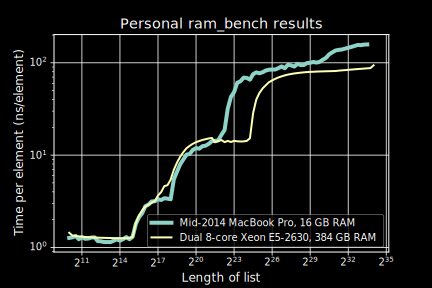

A colleague and I needed to optimize a bottleneck function in our Matlab code, which expanded a matrix in a specific way. This post contains three-ish implementations that we wound up comparing runtime:

1. the initial code the colleague (a long-time Matlab and Python coder) had come up with,
2. a stupid and simple approach I wrote to better understand what it was doing,
3. a complicated approach that suggested itself after a few minutes of Thinking Hard, but that produced slightly wrong outputs, and
4. a tweak on #3 with correct output.

At this point, you’d think that #2 would be the slowest, then #1 (what we started out with), then #3 and/or #4.

Let’s introduce our contestants.

## Problem statement and stupid-simple implementation

Given a 2D array with width `W`, and a `W`-long vector containing non-negative integers, expand the array by replicating each column as many times as specified in the vector.

Here’s the stupid-simple implementation to confirm we understand what that means:
```matlab
function M = stupidSimple(P, reps)
  M = [];
  for colIdx = 1 : length(reps)
    M = [M repmat(P(:, colIdx), 1, reps(colIdx))];
  end
end
```
It’s stupid-simple because it’s expanding the output array at each iteration across the input array—reallocation nightmare! And `repmat`, isn’t that usually slow?

## The original code: a good first effort?

My colleague, no fool, knew reallocating each iteration was bad—it’s a warning in the Matlab linter! Said colleague knew all about *index arrays*, and about `arrayfun`, so used the latter to create one big index array `i`:
```matlab
function M = initialAttempt(P, reps)
  c = arrayfun(@(n, i) i * ones(n, 1), reps, 1 : length(reps), 'un', 0);
  i = cell2mat(c(:));
  M = P(:, i);
end
```
(Matlab, Numpy/Python, Julia, all have this nice aspect to their array domain-specific language: you can index into an array with another *index array* to get a subset of slices of the array. If `x = [10 20 30]`, then `x([3 3 1 2])` is `[30 30 10 20]`. That’s what this code is using.)

This was causing the bottleneck in your Bayesian estimation problem? Hmmm…

## Stroke of luck—I mean, flash of genius!

I doodled with pen-and-paper for a bit, then spent more time typing something unreadable to confirm it worked, and it almost did! (It didn’t handle the case when a column needed to be replicated 0 times, i.e., deleted.)

Here’s that something unreadable:
```matlab
function M = sparseSumZeroBad(P, reps)
  widthM = sum(reps);
  z = zeros(widthM, 1); % vector to be cumsummed

  % indexes of z to be 1 (otherwise z is 0)
  j = [1 1 + cumsum(reps(1 : end - 1))]; % 🌶 pixie dust

  z(j) = 1;
  i = cumsum(z);
  M = P(:, i);
end
```
The core insight is that we can use `cumsum` (cumulative sum, prefix sum, etc.) to build the index array `i` efficiently. That is—if `reps = [4 2 3]`, then index array `i = [1 1 1 1 2 2 3 3 3]`, i.e., four 1s, two 2s, three 3s (confusing choice of example now, but made sense then). The code above is a way of *quickly* generating such an `i` index array by `cumsum`-ing a sparse binary array, specifically, `z = [1 0 0 0 1 0 1 0 0]`.

What took a while to type up was getting those magic numbers in 🌶 to work above. 🌶 above decides where to put the ones in the sparse array.

How did I come up with the correct offsets and indexes in 🌶? Formal reasoning? Rigorous analysis? Logical proof? I confess: I just wrote the code to work for the example I’d doodled, `reps = [4 2 3]`, and it turned out to work for the general case.

I do this a lot and I assumed everyone else did it to: code something by making it work for one specific example that I can visualize, then test to see if it works for the general case. It’s not at all easy to explain or prove to someone why it works. It’s, let’s say, the test-driven development (TDD) approach to numerical computing. It’s been working for me so far.

## Tweak

`sparseSumZeroBad` doesn’t correctly handle the case when `reps` contains 0, i.e., where columns can be deleted, so with some more 🌶s, I tweaked it to get `sparseSum`—you can [read it here](test.m), but it works, all three-ish functions produce the right answer, and we’re approaching the moral of the story: measurement.

## “You must measure everything”
I must quote the great Andrei Alexandrescu, the C++ and D author (of books and the programming languages), from his talk, “Writing Quick Code in C++, Quickly” at GoingNative 2013 ([Youtube](https://www.youtube.com/watch?v=ea5DiCg8HOY&feature=youtu.be&t=5m32s)):

> You must measure everything. We all have intuition. And the intuition of programmers is … always wrong. Outdated. Intuition ignores a lot of aspects of a complex reality. Today’s machine architectures are so complicated, there’re so many variables in flight at any point in time that it’s essentially impossible to consider them deterministic machines any more. They are not deterministic any more. **So we make very often big mistakes when assuming things about what’s going to make fast code.** [E.g.,] fewer instructions ≠ faster code. Data [access] is not always faster than computation. The only good intuition is “I should measure this stuff and see what happens.”
>
> To quote a classic, who is still alive: Walter Bight: “Measuring gives you a leg up on experts who are so good they don’t need to measure.” Walter and I have been working on optimizing bits and pieces of a project we work on [the D programming language] and … ***whenever we think we know what we’re doing, we measure, and it’s just the other way around.***

Programmers might be the first profession to *viscerally* believe and appreciate Duncan Watts when he says that complex systems are ill-served by our common sense evolved to navigate your everyday social life. His book, [*Everything is Obvious—Once You Know the Answer*](http://everythingisobvious.com/the-book/) is likely my favorite book, reigning champion for several years now. We get to *regularly* experience our straightforward and reasonable—oh so reasonable—beliefs going kaput in the face of a the complicated interactions between registers, multiple layers of cache, RAM, swap, and network.

And if you’re not the kind of programmer who optimizes cycles, take it from Andrei and Walter when they say “whenever we think we know what we’re doing, we measure, and it’s just the other way around”.

Further reading: Emil Ernerfeldt’s [“The Myth of RAM, part I”](http://www.ilikebigbits.com/blog/2014/4/21/the-myth-of-ram-part-i). His `ram_bench`, on (1) my mid-2014 MacBook Pro with 16 GB RAM as well as (2) a $10’000 workstation with dual-socket Xeons and 384 GB RAM:



([Raw data available](https://gist.github.com/fasiha/d8b5eae8431dffb3ee14f41f167a6a2a).) Those jumps basically mean the runtime to chew linearly through an `N`-element array might be the *same* as `10 * N` elements 😳! Meanwhile, the runtime might jump ten-fold when the input size doubles 😱! Gadzooks!

Even further reading: Igor Ostrovsky’s [“Fast and slow if-statements: branch prediction in modern processors”](http://igoro.com/archive/fast-and-slow-if-statements-branch-prediction-in-modern-processors/) on another esoteric reason for fast and slow code (and his [“Gallery of Processor Cache Effects”](http://igoro.com/archive/gallery-of-processor-cache-effects/) is a nice recap of Emil Ernerfeldt’s piece). And I rather enjoyed Chad Austin’s notes on squeezing even reasonable performance out of modern CPUs in [“Writing a Really, Really Fast JSON Parser”](https://chadaustin.me/2017/05/writing-a-really-really-fast-json-parser/).

Further watching: Cliff Click, formerly of Azul Systems (where they make thousand-core JVM boxes), has a great talk called “A crash course in modern hardware” (2013, on [InofQ](https://www.infoq.com/presentations/click-crash-course-modern-hardware) and [Youtube](https://www.youtube.com/watch?v=OyTA5EaAb3Y)) where he walks through a precise timeline of a cache miss.

## Speed test
So. Mid-2014 MacBook Pro, Matlab R2016a. In a test harness, expanding each column of a 10×1000 input array between 0 and 39 times,

- the initial code written by colleague came in at 5.1 milliseconds.
- The stupidly-simple reallocate-every-iteration approach aiming at clarity: *1.7×* **faster**.
- The spicy-🌶 using `cumsum` (slightly wrong): **15× faster**.
- The 🌶🌶🌶 tweak on the above, to be absolutely correct: **9.9× faster**.

Lesson 1, for all programmers: reallocating might be fine, even the Matlab linter can’t break Alexandrescu’s Dictum. “You must measure everything.”

Lesson 2, for my numerical colleagues: when working through the nitty-gritty indexing-and-shifting details of an implementation, formal analysis is *always* good, but try getting it to work on one example and tweak till it works for the general case.

(Banner credit: Lewis Hine’s *Photograph of a Workman on the Framework of the Empire State Building*, 1930.
[United States National Archives](https://catalog.archives.gov/id/518290). [Wikimedia](https://commons.wikimedia.org/wiki/File:Old_timer_structural_worker2.jpg).)
