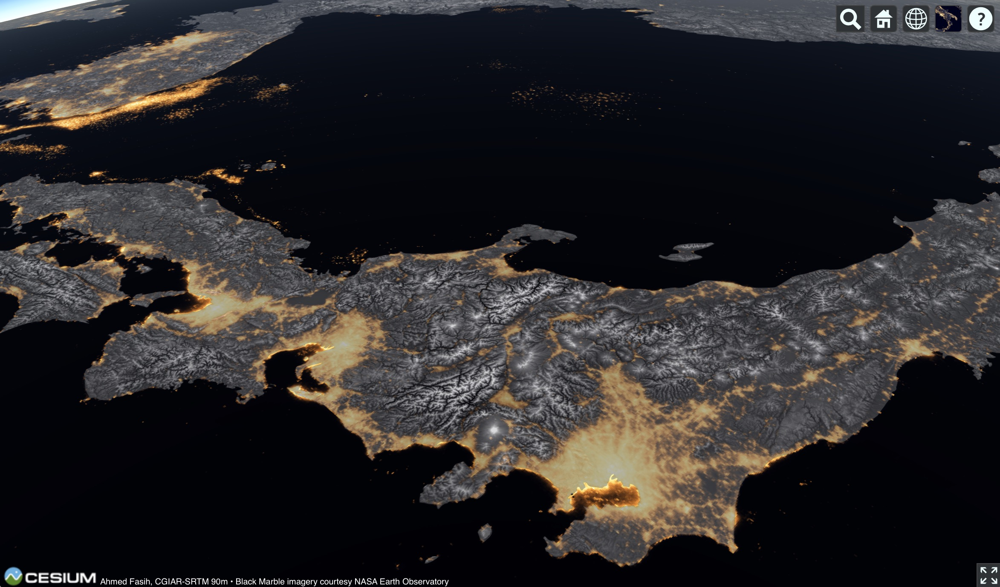
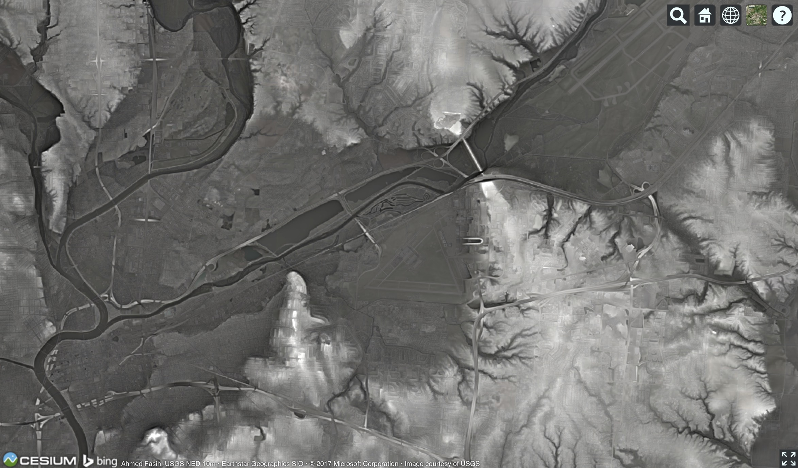
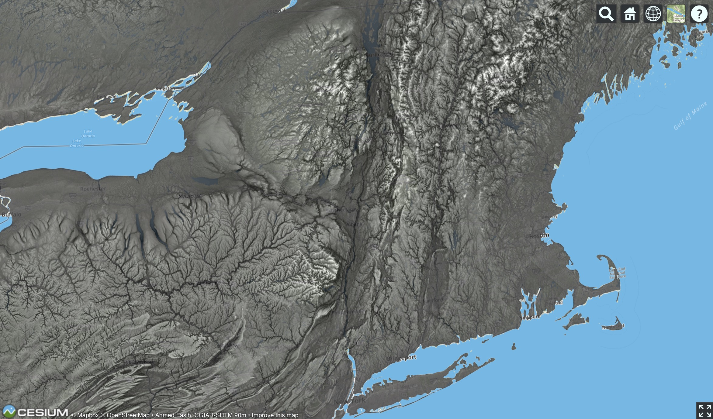
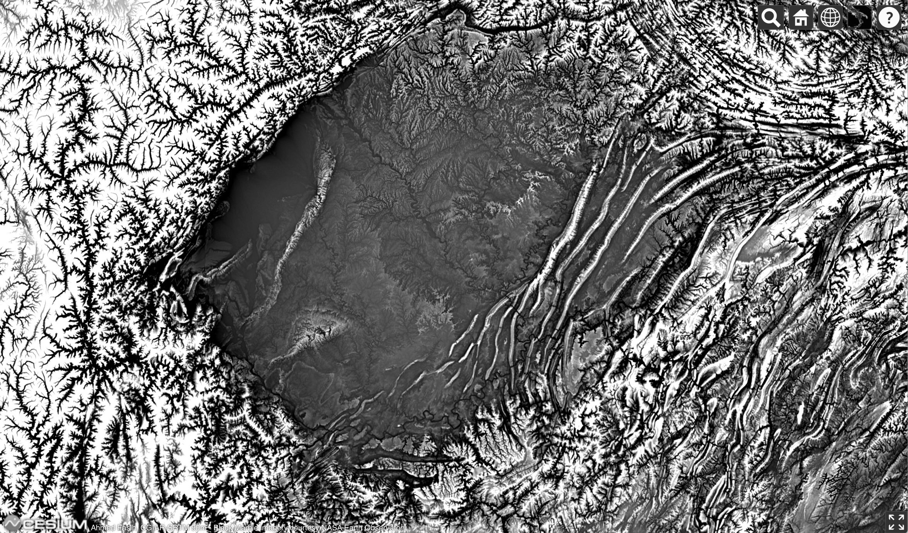
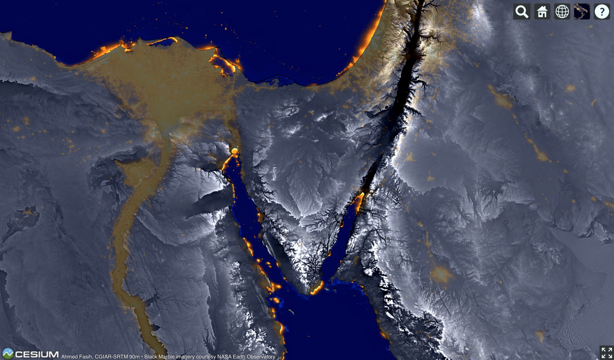

**tl;dr**: visit the [Texture-Shaded Globe webapp](https://fasiha.github.io/texshade-cesium-viewer/) and play around.

**Coders** [Texshade](https://fasiha.github.io/texshade-py/) is my Python implementation of a memory-efficient algorithm.

## Let’s start with six examples.

### Japan: 566 km

 HOVEROVERLAY(japan-black-marble.svg)

This shows Honshu, the big island of Japan, as well as Shikoku and the Korean and Chinese coastlines, from a vantage point floating east of the Asian continent, 566 kilometers above the surface. (The International Space Station hovers around 405 km.)

The huge blob of yellow light in the lower-middle is the Tokyo megalopolis (mouse over the image, and subsequent ones, to see these highlights). Following the nearer coastline left (southwards), you’ll hit two more sprawling blobs of light, the metropolises of Nagoya, then Osaka–Kobe–Kyoto, on either side of the Nara peninsula. The yellow blobs are what the Suomi NPP satellite saw at night, i.e., the [NASA Black Marble](https://www.nasa.gov/topics/earth/earthmonth/earthmonth_2013_5.html).

Superimposed on that image is terrain, in monochrome. The gray and white veins are the backbones of the Japanese mountains. Flat gray is flat land, e.g., Lake Biwa, just north-east of Kyoto. Even at this distance, the symmetry of Mount Fuji is evident—that’s the circle of white terrain south of Tokyo’s sea of yellow. You may have heard that Japan is mountainous, and its people live mainly in the coastal plains and valleys. Now you know.

### Dayton, Ohio, USA: 15 km

 HOVEROVERLAY(daycin.svg)

Here’s the city where I live, from a view fifteen kilometers up, which is the service ceiling of high-end business jets. Those familiar with it notice the a triangle of runways and can locate the National Museum of the US Air Force in the center of the image (pointed out in mouse-over). It’s just below (south) of the Mad River that winds its way southwest from the top of the image, to join the Great Miami River, which has already picked up its other tributary, the Stillwater River, before flowing south out of the bottom-left.

The Museum comfortably sits in the basin of the [Five Rivers Parks](https://en.wikipedia.org/wiki/Five_Rivers_MetroParks), nestled between the hills of Riverside to the north; the hills of Fairborn to the east and Beavercreek to the southeast; and a hilly spur of Dayton proper to the west, a neighborhood called Wright View. Another bright hill close to downtown Dayton is the Woodland Cemetery and Arboretum, where the Wright brothers are buried.

### The Hudson: 835 km

 HOVEROVERLAY(hudson.svg)

The third image is from a vantage 835 kilometers above New York. The eye-catching formation running down the middle of this image is the valley of the Hudson River, which flows south and empties out into the ocean above Manhattan—which you can just make out at the very bottom (mouse-overs are available to help).

To the upper-left of the Hudson’s valley are the Adirondacks, while to their left is the larger spread of the Catskills. To the valley’s right are the large Green Mountains, and further east, the White Mountains, both centering around the whitest veins, the ridges of the mountain chains. Due west of Manhattan you can probably clearly identify what they mean by [Ridge-and-Valley region](https://en.wikipedia.org/wiki/Ridge-and-Valley_Appalachians) of the Appalachians.

You might enjoy identifying all the components in [this schematic](https://commons.wikimedia.org/wiki/File:NortheastAppalachiansMap.jpg) on this higher-resolution view of the terrain—clicking the image will take you to a high-resolution version. Also contrast the prominent drainage pattern of the Catskills—where many rivers end in visible lakes—with the more stony demeanor of the Adirondack peaks.

### Sichuan: 745 km

 HOVEROVERLAY(sichuan.svg)

Let’s return to the Far East to look at the Sichuan Basin from a vantage point 745 kilometers high.

No color here. No basemap. Just monochrome terrain. The frantic fractal mountains to the left (west) are the start of the Tibetan massif. Lower mountains ring the other directions as well. In the middle though we have a patch of peaceful-seeming flatland.

Sichuan is written 四川 in the original. Four 四 rivers 川. In that flatland, you can see the sinuous line of some of those rivers. The thin lines aren’t the rivers themselves—the biggest of lines are a few kilometers wide. What you see as rivers are actually the river valleys carved out by flip-flopping rivers over the millennia.

### The Sinai: 945 km

 HOVEROVERLAY(sinai.svg)

Our fifth example puts the terrain back on top of the NASA Black Marble, of the earth at night, but with colors saturated to bleed through the terrain. The fox face in the middle is the Sinai Peninsula. To its left (west) you see the Nile, both it’s broad valley flanked by terrain and the orange of its nearly ninety millions. The triangle of the Nile Delta has no visible terrain—it’s so flat.

A scar runs along the fox-faced Sinai’s right cheek. In the middle of it, very nearly black, is the Dead Sea, the lowest point on earth. To the left of this cleft are the teeming cities of Israel and occupied Palestine, and to its right those of Jordan. At the bottom-right, you can see the Hijazi mountains, the Barrier separating coastal Tihamah from the Najdi interior.

The whole area—cradles of civilization, 4’500 year old pyramids (as ancient to the Ancient Romans as the Romans are to us), the Late Bronze Age collapse, the Exodus, down to the Intifadas and Arab Spring and modern upheavals—seeing the stage of this drama in such detail leaves me breathless.

There’s this [other view](https://commons.wikimedia.org/wiki/File:Nile_River_Delta_at_Night.JPG) of this scene that you might enjoy.

### Above central Ukraine, looking west: 2155 km

 HOVEROVERLAY(europe-from-east.svg)

Five times higher than the International Space Station comes this view, imitating the classic 1944 infographic painting, [“Europe From the East” by Richard Edes Harrison](http://www.davidrumsey.com/luna/servlet/detail/RUMSEY~8~1~266329~5504885:Europe-From-The-East#), stunning as a huge coffee-table-sized print.

In the image above, the earth’s colors are hinted by the underlying [MapBox Cloudless Atlas](https://www.mapbox.com/blog/cloudless-atlas-with-landsat/) basemap, above which sits the terrain in monochrome. It’s this terrain layer rendering those Alps white—the satellite-derived basemap has barely any snow.

Just south (left) of those Alps is a shadowy flatland: that’s the Po Valley, the productive plain of the Emilia-Romagna region containing busy Milan, lovely Bologna, and stunning Venice. The near-black is a function of the suddenness with which the Alps crash onto that plain, a suddenness which no doubt was appreciated by Hannibal.

North of the Alps, there’re no drops as sharp as this so no deep shadows, but something of note—that huge channel running north from the Alps up into Germany, that’s the Rhine River in there. The river didn’t carve the valley, which is actually a [continental rift phenomenon](https://en.wikipedia.org/w/index.php?title=Rhine&oldid=781522255#Alpine_orogeny). To the west of the Rhine you can see the sinuous winding of the Paris-splitting Seine pouring into the Atlantic north of the Cotentin Peninsula.

On the other side of the Alps begins the arc of the Carpathian Mountains curving east from Kraków in Poland and southeast into Romania, where they turn sharply right to meet the Transylvanian Mountains that then march westwards to the Romanian–Serbian border (the famed Iron Gates, visible as a gash of black) before turning south and crashing into the Balkan Mountain range that have been busily splitting Bulgaria from the Black Sea coast.

And between that bulge formed by the Carpathian and Balkan ranges is nestled the river valley of the blue Danube, emptying out into the Black Sea after starting on the eastern flank of the Rhine way out near the German–Swiss–French border and stringing together the exquisite pearls of Vienna, Bratislava, Budapest, and Belgrade (the capital jewels of Austria, Slovakia, Hungary, and Serbia).

Two million meters tall, this view has a lot more that can be said about it, but I will stop here.

## Fasten your seatbelts

All these images offer some pretty good resolution and I’m deeply sorry if you visited this page on a slow internet connection. Viewing them at full-zoom will likely make every winding river valley or every cracked mountain spine bigger by a factor of two, maybe four. Scroll around, see what you can see.

Then. If you’re at a recent computer with a WebGL-enabled browser, click of these links to go to the web app that generated all four of these images.

- [Japan][japan]
- [Dayton][daycin]
- [The Hudson][hudson]
- [Sichuan][sichuan]
- [Sinai][sinai]
- [Europe][europe]

Play with the controls. When you’ve had enough, come back and we’ll explain below.

## Texture-shading

Upcoming.

[crimea]: https://fasiha.github.io/texshade-cesium-viewer/#%7B%22version%22%3A0%2C%22baseLayerPicked%22%3A%7B%22name%22%3A%22The%20Black%20Marble%22%2C%22iconUrl%22%3A%22http%3A%2F%2Fmaps.aldebrn.me%2FBuild%2FCesium%2FWidgets%2FImages%2FImageryProviders%2FblackMarble.png%22%7D%2C%22baseTerrainPicked%22%3A%7B%22name%22%3A%22WGS84%20Ellipsoid%22%7D%2C%22layers%22%3A%5B%7B%22url%22%3A%22%2F%2Fcesiumjs.org%2Fblackmarble%22%2C%22isBaseLayer%22%3Atrue%2C%22alpha%22%3A1%2C%22brightness%22%3A1%2C%22contrast%22%3A1%2C%22hue%22%3A0%2C%22saturation%22%3A1%2C%22gamma%22%3A1%7D%2C%7B%22url%22%3A%22http%3A%2F%2Fmaps.aldebrn.me%2Fworld-tex-cgiar-90m%22%2C%22isBaseLayer%22%3Afalse%2C%22alpha%22%3A0.7%2C%22brightness%22%3A0.98%2C%22contrast%22%3A3%2C%22hue%22%3A0%2C%22saturation%22%3A1%2C%22gamma%22%3A3%7D%5D%2C%22terrainExaggeration%22%3A1%2C%22destination%22%3A%7B%22x%22%3A3956085.01170706%2C%22y%22%3A2658694.6040228875%2C%22z%22%3A4776774.409817503%7D%2C%22orientation%22%3A%7B%22heading%22%3A6.150109241304203%2C%22pitch%22%3A-1.5548664680704714%2C%22roll%22%3A0%7D%7D

[europe]: https://fasiha.github.io/texshade-cesium-viewer/#%7B%22version%22%3A0%2C%22baseLayerPicked%22%3A%7B%22name%22%3A%22Mapbox%20Satellite%22%2C%22iconUrl%22%3A%22http%3A%2F%2Fmaps.aldebrn.me%2FBuild%2FCesium%2FWidgets%2FImages%2FImageryProviders%2FmapboxSatellite.png%22%7D%2C%22baseTerrainPicked%22%3A%7B%22name%22%3A%22WGS84%20Ellipsoid%22%7D%2C%22layers%22%3A%5B%7B%22url%22%3A%22%2F%2Fapi.mapbox.com%2Fv4%2F%22%2C%22isBaseLayer%22%3Atrue%2C%22alpha%22%3A1%2C%22brightness%22%3A1%2C%22contrast%22%3A1%2C%22hue%22%3A0%2C%22saturation%22%3A3%2C%22gamma%22%3A1%7D%2C%7B%22url%22%3A%22http%3A%2F%2Fmaps.aldebrn.me%2Fworld-tex-cgiar-90m%22%2C%22isBaseLayer%22%3Afalse%2C%22alpha%22%3A0.86%2C%22brightness%22%3A1.3%2C%22contrast%22%3A5%2C%22hue%22%3A0%2C%22saturation%22%3A1%2C%22gamma%22%3A1%7D%5D%2C%22terrainExaggeration%22%3A1%2C%22destination%22%3A%7B%22x%22%3A4596057.84922899%2C%22y%22%3A2996920.8694578307%2C%22z%22%3A6519928.159490867%7D%2C%22orientation%22%3A%7B%22heading%22%3A4.518257183901266%2C%22pitch%22%3A-1.0325489903556369%2C%22roll%22%3A6.281328392869174%7D%7D

[sinai]: https://fasiha.github.io/texshade-cesium-viewer/#%7B%22version%22%3A0%2C%22baseLayerPicked%22%3A%7B%22name%22%3A%22The%20Black%20Marble%22%2C%22iconUrl%22%3A%22http%3A%2F%2Fmaps.aldebrn.me%2FBuild%2FCesium%2FWidgets%2FImages%2FImageryProviders%2FblackMarble.png%22%7D%2C%22baseTerrainPicked%22%3A%7B%22name%22%3A%22WGS84%20Ellipsoid%22%7D%2C%22layers%22%3A%5B%7B%22url%22%3A%22%2F%2Fcesiumjs.org%2Fblackmarble%22%2C%22isBaseLayer%22%3Atrue%2C%22alpha%22%3A1%2C%22brightness%22%3A1%2C%22contrast%22%3A1%2C%22hue%22%3A0%2C%22saturation%22%3A3%2C%22gamma%22%3A1%7D%2C%7B%22url%22%3A%22http%3A%2F%2Fmaps.aldebrn.me%2Fworld-tex-cgiar-90m%22%2C%22isBaseLayer%22%3Afalse%2C%22alpha%22%3A0.84%2C%22brightness%22%3A1.22%2C%22contrast%22%3A3%2C%22hue%22%3A0%2C%22saturation%22%3A1%2C%22gamma%22%3A1%7D%5D%2C%22terrainExaggeration%22%3A1%2C%22destination%22%3A%7B%22x%22%3A5290854.567243439%2C%22y%22%3A3560796.5956659717%2C%22z%22%3A3588048.238531111%7D%2C%22orientation%22%3A%7B%22heading%22%3A6.139467117973812%2C%22pitch%22%3A-1.5563300568612175%2C%22roll%22%3A0%7D%7D

[japan]: https://fasiha.github.io/texshade-cesium-viewer/#%7B%22version%22%3A0%2C%22baseLayerPicked%22%3A%7B%22name%22%3A%22The%20Black%20Marble%22%2C%22iconUrl%22%3A%22http%3A%2F%2Fmaps.aldebrn.me%2FBuild%2FCesium%2FWidgets%2FImages%2FImageryProviders%2FblackMarble.png%22%7D%2C%22baseTerrainPicked%22%3A%7B%22name%22%3A%22WGS84%20Ellipsoid%22%7D%2C%22layers%22%3A%5B%7B%22url%22%3A%22%2F%2Fcesiumjs.org%2Fblackmarble%22%2C%22isBaseLayer%22%3Atrue%2C%22alpha%22%3A1%2C%22brightness%22%3A1%2C%22contrast%22%3A1%2C%22hue%22%3A0%2C%22saturation%22%3A1%2C%22gamma%22%3A0.48%7D%2C%7B%22url%22%3A%22http%3A%2F%2Fmaps.aldebrn.me%2Fworld-tex-cgiar-90m%22%2C%22isBaseLayer%22%3Afalse%2C%22alpha%22%3A0.52%2C%22brightness%22%3A1.32%2C%22contrast%22%3A1.4%2C%22hue%22%3A0%2C%22saturation%22%3A1%2C%22gamma%22%3A1%7D%5D%2C%22terrainExaggeration%22%3A1%2C%22destination%22%3A%7B%22x%22%3A-4555669.674111755%2C%22y%22%3A3702876.47327235%2C%22z%22%3A3697615.9732322954%7D%2C%22orientation%22%3A%7B%22heading%22%3A5.681369036822533%2C%22pitch%22%3A-0.8218479123823927%2C%22roll%22%3A0.027079069039927184%7D%7D

[sichuan]: https://fasiha.github.io/texshade-cesium-viewer/#%7B%22version%22%3A0%2C%22baseLayerPicked%22%3A%7B%22name%22%3A%22The%20Black%20Marble%22%2C%22iconUrl%22%3A%22http%3A%2F%2Fmaps.aldebrn.me%2FBuild%2FCesium%2FWidgets%2FImages%2FImageryProviders%2FblackMarble.png%22%7D%2C%22baseTerrainPicked%22%3A%7B%22name%22%3A%22WGS84%20Ellipsoid%22%7D%2C%22layers%22%3A%5B%7B%22url%22%3A%22%2F%2Fcesiumjs.org%2Fblackmarble%22%2C%22isBaseLayer%22%3Atrue%2C%22alpha%22%3A1%2C%22brightness%22%3A1%2C%22contrast%22%3A1%2C%22hue%22%3A0%2C%22saturation%22%3A1%2C%22gamma%22%3A1%7D%2C%7B%22url%22%3A%22http%3A%2F%2Fmaps.aldebrn.me%2Fworld-tex-cgiar-90m%22%2C%22isBaseLayer%22%3Afalse%2C%22alpha%22%3A1%2C%22brightness%22%3A1.26%2C%22contrast%22%3A3%2C%22hue%22%3A0%2C%22saturation%22%3A1%2C%22gamma%22%3A1%7D%5D%2C%22terrainExaggeration%22%3A1%2C%22destination%22%3A%7B%22x%22%3A-1680812.5781039044%2C%22y%22%3A5928345.92553644%2C%22z%22%3A3564399.711321817%7D%2C%22orientation%22%3A%7B%22heading%22%3A6.274816124366115%2C%22pitch%22%3A-1.570034204520696%2C%22roll%22%3A0%7D%7D

[daycin]:  https://fasiha.github.io/daycin/Apps/#%7B%22version%22%3A0%2C%22baseLayerPicked%22%3A%7B%22name%22%3A%22Bing%20Maps%20Aerial%22%2C%22iconUrl%22%3A%22https%3A%2F%2Ffasiha.github.io%2Fdaycin%2FBuild%2FCesium%2FWidgets%2FImages%2FImageryProviders%2FbingAerial.png%22%7D%2C%22baseTerrainPicked%22%3A%7B%22name%22%3A%22WGS84%20Ellipsoid%22%7D%2C%22layers%22%3A%5B%7B%22url%22%3A%22%2F%2Fdev.virtualearth.net%22%2C%22isBaseLayer%22%3Atrue%2C%22alpha%22%3A1%2C%22brightness%22%3A1%2C%22contrast%22%3A1.22%2C%22hue%22%3A0%2C%22saturation%22%3A1%2C%22gamma%22%3A1.08%7D%2C%7B%22url%22%3A%22..%2Ftiles%22%2C%22isBaseLayer%22%3Afalse%2C%22alpha%22%3A0.9%2C%22brightness%22%3A1%2C%22contrast%22%3A1.4%2C%22hue%22%3A0%2C%22saturation%22%3A1%2C%22gamma%22%3A0.68%7D%5D%2C%22terrainExaggeration%22%3A1%2C%22destination%22%3A%7B%22x%22%3A504706.8355537353%2C%22y%22%3A-4893815.209792661%2C%22z%22%3A4069458.683224584%7D%2C%22orientation%22%3A%7B%22heading%22%3A0.0032050530316229953%2C%22pitch%22%3A-1.5707141038036494%2C%22roll%22%3A0%7D%7D

[hudson]: https://fasiha.github.io/texshade-cesium-viewer/#%7B%22version%22%3A0%2C%22baseLayerPicked%22%3A%7B%22name%22%3A%22Mapbox%20Streets%22%2C%22iconUrl%22%3A%22http%3A%2F%2Fmaps.aldebrn.me%2FBuild%2FCesium%2FWidgets%2FImages%2FImageryProviders%2FmapboxTerrain.png%22%7D%2C%22baseTerrainPicked%22%3A%7B%22name%22%3A%22WGS84%20Ellipsoid%22%7D%2C%22layers%22%3A%5B%7B%22url%22%3A%22%2F%2Fapi.mapbox.com%2Fv4%2F%22%2C%22isBaseLayer%22%3Atrue%2C%22alpha%22%3A1%2C%22brightness%22%3A1%2C%22contrast%22%3A1%2C%22hue%22%3A0%2C%22saturation%22%3A1%2C%22gamma%22%3A1%7D%2C%7B%22url%22%3A%22http%3A%2F%2Fmaps.aldebrn.me%2Fworld-tex-cgiar-90m%22%2C%22isBaseLayer%22%3Afalse%2C%22alpha%22%3A0.86%2C%22brightness%22%3A1%2C%22contrast%22%3A2.5%2C%22hue%22%3A0%2C%22saturation%22%3A1%2C%22gamma%22%3A1.84%7D%5D%2C%22terrainExaggeration%22%3A1%2C%22destination%22%3A%7B%22x%22%3A1467237.0149951847%2C%22y%22%3A-5040591.413295751%2C%22z%22%3A4932743.9292378975%7D%2C%22orientation%22%3A%7B%22heading%22%3A0.06478440361275162%2C%22pitch%22%3A-1.569780019850889%2C%22roll%22%3A0%7D%7D
